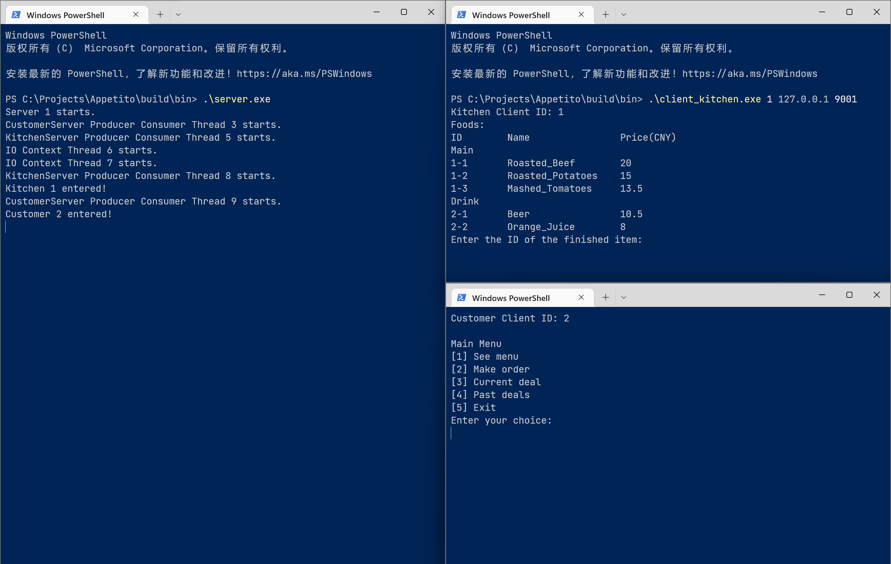
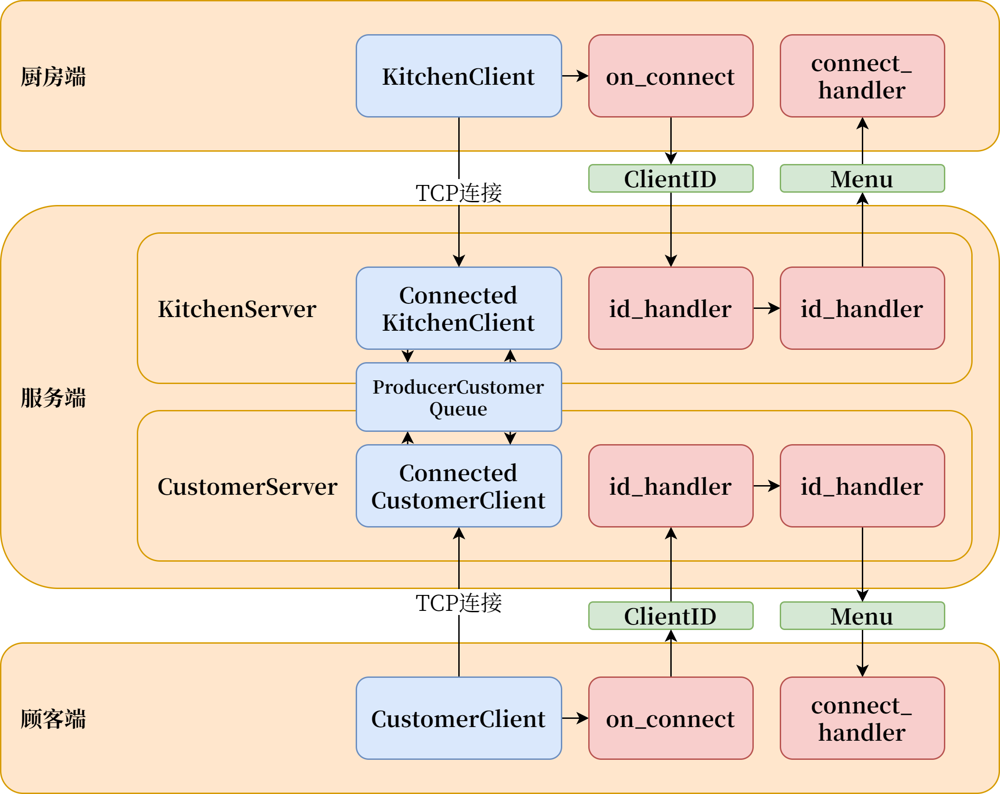
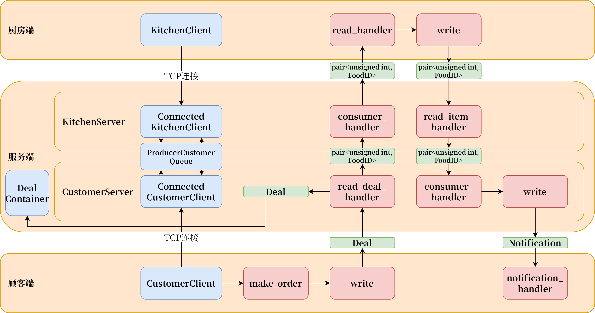

           

# 🍜 吃了没 Appetito 

# 餐厅点餐系统说明文档

电子信息科学与技术 22-2班

G23F3613小组
王嘉伟 2022217235
王梓萌 2022217237
王士涵 2022217264

特别鸣谢
宣善立老师

ver 1.0
2023/01/05

                 

# 目录

[TOC]

              

# 文档正文

## 概述

吃了没 Appetito 餐厅点餐系统，是一个基于 C++ 实现的、含有一个多线程服务端和两种类型客户端的餐厅点餐自动化系统。

- 系统拥有简单易用的命令行用户界面，对客户使用比较友好。

- 系统的菜品数据、餐位数据等从文件中读取，方便维护修改。

- 系统各端通过 TCP 网络通讯，允许在局域网乃至广域网的不同设备上部署系统的服务端和各种客户端，例如在餐厅后台电脑上部署服务端、在后厨的设备上部署后厨端，在给客人的点单设备上部署顾客端。

- 通过多线程和异步 IO ，系统服务端实现了多种客户端、多个客户端请求的同时处理。

## 使用方法

1. 在命令行中打开build\bin文件夹下的服务端 server.exe ，然后打开顾客端 client_customer.exe 和后厨端 client_kitchen.exe。

    client_customer.exe 和 client_kitchen.exe 均接受 3 个参数：客户端 ID 、服务器 IP 地址、服务器端口。
    本地 IP 地址通常是 127.0.0.1 ，顾客端口是 9000 ，后厨端口是 9001 。
    

2. 服务端会有运行状况输出，包括线程启动和停止、客户端连接、订单等。

3. 顾客端可以直接按菜单和提示操作。

4. 每当有新的任务时，后厨端会给予提示，如果完成了某项菜品的制作，可以向后厨端命令行输入该菜品的 ID （在提示中有显示，格式为“订单编号-菜品类型编号-菜品编号”） 。

## 设计思想说明

系统设计的目标是效率高、模块化、部署简单。
系统采用模块化设计，以提高可维护性。
完全使用面向对象程序设计思想，辅以通用程序设计思想以增加代码复用。
基本遵循 MVC 设计模式。
多线程开发中使用互斥锁保证资源的线程安全。
遵循 RAII 原则，保证资源的内存安全。
尽量使用了 C++ 标准库的函数和容器等，保证代码的通用性。
开发过程中采用了统一的命名方式，尽量让代码可以解释自身，减少对注释的依赖。

## 系统结构说明

系统结构如下：

## 功能流程说明

连接流程如下：

点菜流程如下：

## 模块说明

[Doxygen文档](doxygen_docs/html/index.html)

# 开发过程

## 每人承担任务

王嘉伟：用户输入输出模块、菜品模块
王梓萌：主程序模块、网络输入输出模块、控制器模块、订单模块
王士涵：菜单模块、桌位模块

## 感想

Fred Brooks 说过，软件是一类创造性的知识密集型产品, 是人类迄今为止最复杂的制品。
软件工程的点点滴滴都是人类对工程方法探索的结晶。在这次大作业的开发中，我们深深感到了这一点。
以真正工程化的思维和方法去创造一个新东西的过程令我们激动。这个过程中有热烈的讨论、有冷静的思考，有发现路线错误时的沮丧、有想要把最后一点问题找出来时的不眠不休。
对我们三个人的团队，这4000行代码的工程量的确有点令人望而生畏。但是我们互相鼓劲、互相帮助，从最困难的打基础到最后实际的功能实现，越来越得心应手；到最后，我们都超越了自我，基本上完成了任务。
这一次大作业给我们的经验，绝对是一笔宝贵的财富。

## 参考

书目
《Programming Principles and Practice Using C++ - Second Edition》, Bjarne Stroustrup
《The C++ Programming Language》, Bjarne Stroustrup
《C++ Primer》, Bjarne Stroustrup
《Boost.Asio C++ Network Programming》, John Torjo
开源项目
[C++ Core Guidelines](https://isocpp.github.io/CppCoreGuidelines/)
[asio C++ library](https://think-async.com)
[cereal](https://uscilab.github.io/cereal/)
[doxygen](https://www.doxygen.nl/)

## 运用工具

系统的 TCP Socket 通讯、生产者-消费者队列等基于 asio 库实现，数据结构序列化/反序列化使用 cereal 库实现。
开发过程中使用了 Git 版本控制系统和 GitHub 代码托管平台，以提高协作效率。
使用 CMake 和 Ninja 辅助编译模块化设计的众多头文件和源代码文件。
使用 gdb 辅以 VS Code 的“运行和调试”界面进行断点调试。
使用 Doxygen 生成类文档。
