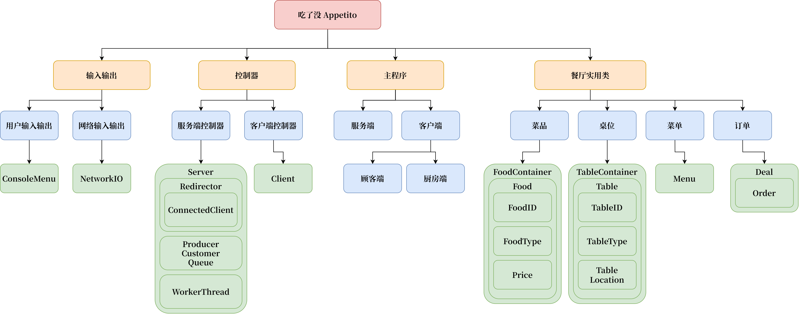

# 吃了没 餐厅点餐系统 说明文档

## 团队

电子信息科学与技术 22-2班

G23F3613小组
王嘉伟 2022217235
王梓萌 2022217237
王士涵 2022217264

特别鸣谢 宣善立老师

## 概述

吃了没 Appetito 餐厅点餐系统，是一个基于 C++ 实现的、含有一个多线程服务端和两种类型客户端的餐厅点餐自动化系统。

## 设计思想说明

系统设计的目标是效率高、模块化、部署简单。
系统采用模块化设计，以提高可维护性。
完全使用面向对象程序设计思想，辅以通用程序设计思想以增加代码复用。
基本遵循 MVC 设计模式。
多线程开发中使用互斥锁保证资源的线程安全。
遵循 RAII 原则，保证资源的内存安全。
尽量使用了 C++ 标准库的函数和容器等，保证代码的通用性。

## 系统结构说明

系统结构如下：

## 功能流程说明

## 模块设计说明

## 每人承担任务

## 感想

## 运用工具

系统的 TCP Socket 通讯、生产者-消费者队列等基于 asio 库实现，数据结构序列化/反序列化使用 cereal 库实现。
开发过程中使用了 Git 版本控制系统和 GitHub 代码托管平台，以提高协作效率。
使用 CMake 和 Ninja 辅助编译模块化设计的众多头文件和源代码文件。
使用 gdb 辅以 VS Code 的“运行和调试”界面进行断点调试。
使用 Doxygen 生成类文档。
